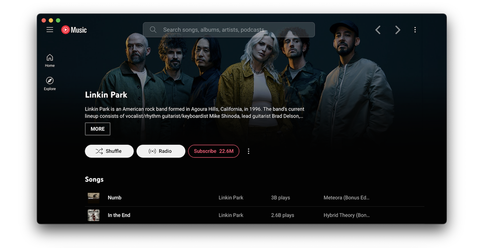

# YouTube Music Desktop App 조사 및 연구
## 팀원
      응용생명과학부 식물생명과학전공/2021428910/김승훈 (byeol-leaf)
      산림과학조경학부 임산공학과/2020115356/조준호 (jojunho0120)
      원예과학과/2016115464/최찬우 (cksdn)
      식품영양학과/2024005365/차서영 (chaseoyoung)
      의예과/2023023643/최인녕 (innyeong)

## 1. 개요:

[**유튜브 뮤직 웹 서비스**](https://music.youtube.com/)의 인터페이스를 유지하는 것을 목표하는 데스크톱 앱입니다. 맞춤 플러그인을 필요에 따라 활성화/비활성화할 수 있습니다. 약 30가지 이상 플러그인을 원하는 대로 사용할 수 있습니다. 스타일, 콘텐츠, 기능 등에 따라 제공되는 플러그인을 설정하여 유튜브 뮤직을 변경할 수 있습니다. HTML/CSS를 조작하여 나만의 플러그인을 개발 · 적용할 수 있습니다.

- GitHub에 배포된 최신 버전은 [v3.8.0](https://github.com/th-ch/youtube-music/releases/tag/v3.8.0)입니다.
- 설치 가능한 OS는 Windows(64bit, 32bit, ARM64), Linux, MacOS입니다.
- [레포지토리 바로가기](https://github.com/th-ch/youtube-music)

## 2. 라이선스:
The MIT License (MIT)를 사용하고 있습니다.

## 3. 주요기능:

### Last.fm Scrobbler 기능

 Last.fm Scrobbling은 사용자가 어떤 음악을 언제, 얼마나 들었는지 자동으로 기록해주는 기능입니다. 이렇게 저장된 데이터는 나중에 음악 취향 분석, 추천, 통계, 감상 히스토리 확인 등에 활용됩니다. 쉽게말해 Scrobbling은 음악 감상 이력을 자동으로 Last.fm 계정에 전송하는 것을 말합니다.

유튜브 뮤직과 Last.fm의 작동방법은 기본적으로 Last.fm scrobble 기능을 지원하지 않기 때문에, 서드파티 툴을 사용해서 기능을 구현해야 합니다. 툴을 사용하는 주요 방법으로는 Chrome, Firefox, Edge 등에서 사용 가능한 확장 프로그램이 있습니다. 유튜브 뮤직 웹 플레이어에서 감상 중인 트랙 정보를 실시간으로 추적하고 Last.fm에 전송해주는 Web Scrobbler(브라우저 확장)과 Android 기기에서는 음악 알림을 기반으로 YouTube Music 감상 기록을 scrobble하는 앱들이 있는 YouScrobble, Pano Scrobbler(모바일용)이 있습니다.

사용의 장점으로는 언제 어떤 곡을 얼마나 들었는지 기록되고, last.fm의 통계/분석 기능 활용이 가능하고, Spotify, Deezer 등과 함께 통합 분석이 가능하고, 친구들과 음악 취향을 공유, 비슷한 취향 사용자 발견이 가능하다는 점입니다. 주의사항으로는 유튜브 뮤직이 공식 지원하는 기능이 아니라 브라우저 탭이 열려 있어야 감지되고, 잘못 인식되는 곡은 수동 수정이 필요하고, 모바일에서는 일부 곡이 인식되지 않을 수 있다는 점을 주의해야 합니다.

---

### 크로스페이드(crossfade) 기능

 유튜브 뮤직의 크로스페이드 기능은 두 곡이 자연스럽게 이어지도록 음원을 전환할 때 두 곡의 소리가 겹쳐서 점진적으로 하나의 곡에서 다른 곡으로 넘어가는 기능입니다. 이 기능은 앞 곡의 페이드 아웃(fade-out)과 뒤 곡의 페이드 인(fade-in)을 연결하여, 곡의 전환을 매끄럽게 만들 수 있으며, 음악을 감상할 때 끊김 없이 즐길 수 있습니다.

주요 특징

1) 연속적인 음악 감상
크로스페이드를 활성화하면 곡이 끝날 때 다음 곡이 시작되는 지점에서 소리가 자연스럽게 섞여서 음악이 끊기지 않고 이어집니다.
2) 시간 조정
크로스페이드의 길이를 조정할 수 있어, 원하는 시간 동안 곡이 겹쳐서 넘어가도록 설정할 수 있습니다. 5초 또는 10초 등 원하는 길이로 설정할 수 있습니다.
3) 플러그인 활성화
유튜브 뮤직에서 이 기능을 활성화하려면 설정 메뉴에서 찾을 수 있으며, 여러 사용자 환경에 맞게 설정을 조정할 수 있습니다.

이 기능은 운동을 하거나 기타 취미 활동을 하는 등 음악을 계속 이어서 들을 때 유용하게 사용할 수 있는 기능입니다.

---

### 단축키 기능

단축키
 유튜브 뮤직에서 재생을 위한 전역 단축키 설정 허용(재생/일시 정지/다음/이전),  미디어 키를 재정의하여 미디어 osd 비활성화, Ctrl/CMD + F 검색 활성화가 가능합니다. 또한, 고급 사용자를 위한 사용자 지정 단축키 지원이 가능한 것도 특징적입니다. 주로 웹 브라우저에서 유튜브 뮤직을 제어하는 데 사용됩니다. 사용자가 웹 페이지에서 직접 곡을 제어하는 기능이므로, 브라우저에서 바로 조작할 수 있습니다.

주요 단축키
재생/일시 정지 : Space 키 또는 k 키

다음 곡 : Shift + → (오른쪽 화살표)

이전 곡 : Shift + ← (왼쪽 화살표)

음량 조절 : ↑ (음량 증가), ↓ (음량 감소)

곡 건너뛰기 : l (곡 건너뛰기)

곡 반복 : r (반복 설정)

재생 목록 열기 : Ctrl + Shift + M (Windows), Cmd + Shift + M (Mac)

검색 : Ctrl + k (Windows), Cmd + k (Mac)

---

### MPRIS (Media Player Remote Interfacing Specification) 기능

 MPRIS는 리눅스 기반의 시스템에서 주로 사용되는 표준 API로, 미디어 플레이어의 기능을 다른 애플리케이션에서 원격으로 제어할 수 있게 해주는 시스템입니다. 유튜브 뮤직에서는 MPRIS를 통해, 미디어 플레이어 제어를 보다 직관적으로 할 수 있습니다.

MPRIS의 주요 기능
1) 미디어 제어
유튜브 뮤직을 재생, 일시 정지, 건너뛰기, 이전 곡으로 돌아가기 등을 할 수 있습니다.

2) 트랙 정보 제공
현재 재생 중인 곡의 제목, 아티스트, 앨범 등을 다른 애플리케이션에 표시할 수 있습니다.

3) 볼륨 조정
MPRIS를 지원하는 애플리케이션에서 미디어 볼륨을 직접 제어할 수 있습니다.
  
---

### 앨범 컬러 기반 테마(Album Color Theme) 기능

 YouTube Music 데스크톱 앱을 자주 사용하는 이들에게 ‘음악을 듣는 경험’은 단순히 귀에 닿는 소리에 그치지 않습니다. 플레이리스트 하나, 앨범 하나를 틀어두었을 뿐인데, 어느새 앱 전체가 그 음악의 분위기를 따라 변해가는 것이 앨범 컬러 기반 테마(Album Color Theme) 기능이 주는 감각적 경험입니다.

이 플러그인을 활성화하면, 재생 중인 앨범의 커버 아트에서 색상이 실시간으로 추출되어 앱 UI 전반에 적용됩니다. 배경 색상은 물론이고, 버튼, 재생 바, 하이라이트 요소까지 앨범의 분위기와 일치하는 색조로 매끄럽게 변화합니다. 이는 사용자가 단순히 음악을 듣는 것을 넘어서, 음악의 세계관 안으로 시각적으로도 들어가게 만드는 몰입감 있는 경험을 제공합니다.

예를 들어, Taylor Swift의 ‘Midnights’ 앨범을 재생하면 화면은 잔잔한 블루와 어두운 회색빛으로 감싸이고, Billie Eilish의 ‘Happier Than Ever’를 플레이하면 따뜻한 베이지톤이 앱 전체에 물듭니다. 곡이 바뀔 때마다 테마가 살아 움직이는 듯한 이 변화는, 마치 음악과 앱이 함께 호흡하고 있는 듯한 느낌을 줍니다. 이 경험은 단순한 '예쁨'이 아니라, 사용자 감정과 감각에 자연스럽게 동기화되며, 음악을 더 깊이 이해하고 느끼게 만드는 감성적 UI입니다. 특히 감정 이입이 중요한 발라드나 분위기 중심의 앰비언트 음악을 들을 때, 이런 시각적 연출은 음악과의 정서적 연결감을 훨씬 더 강하게 만들어줍니다.

개발자 입장에서 이 기능은 기술과 감성의 교차점에 있는 흥미로운 과제입니다. 앨범 커버에서 컬러 팔레트를 추출하는 과정은 단순한 이미지 처리 그 이상이며, 가장 지배적인 색만 뽑는 게 아니라, 명도와 채도, 시인성, 색상 조화도 함께 고려해야 합니다. 추출된 색상이 UI에 적용되었을 때 글씨가 잘 보이는지, 분위기를 해치지 않는지까지 신경 써야 하기 때문입니다. 이때 color-thief, vibrant.js 같은 컬러 추출 라이브러리나 Electron 기반의 동적 테마 적용 기술이 유용하게 활용됩니다. 사용자의 감정을 건드리는 시각적 피드백을 만들어내기 위해, 개발자는 단순한 코드 이상의 고민을 하게 되는데 이는 음악과 색, 그리고 사람 사이의 연결 고리를 UI 설계와 알고리즘으로 조율하는 섬세한 작업입니다.

결과적으로, 앨범 컬러 기반 테마는 감성과 기술이 만나 사용자 경험(UX: User eXperience)을 새로운 차원으로 끌어올린 사례입니다. 단순히 보기 좋은 디자인을 넘어, 사용자 몰입감, 정서적 동기화, 그리고 아티스트의 정체성까지 사용자 인터페이스(UI: User Interface) 속에 녹여내는 이 기능은 향후 디지털 음악 플랫폼들이 지향해야 할 경험 중심의 디자인 방향을 잘 보여줍니다. YouTube Music의 이 작은 플러그인이 만들어내는 감각의 변화는, 음악 감상의 미래를 암시하고 있습니다.
  
---

### 다섯 번째 기능
  
  ...
